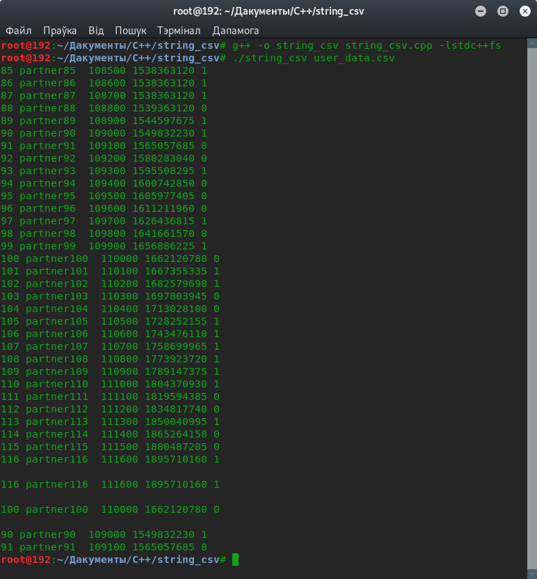

# string_csv

Праграма счытвае з csv-файлу дадзеныя ў фармаце id;partner;number;date;status. ("date" ў фармаце unix timestamp).
Затым стартыруе ў парадку id, выводзячы ўсё ў кансоль, пасьля адбірае радок з найвялікшым id, радок, у якога id роўны 100, а таксама радкі, датаваныя 2019-ым годам.

